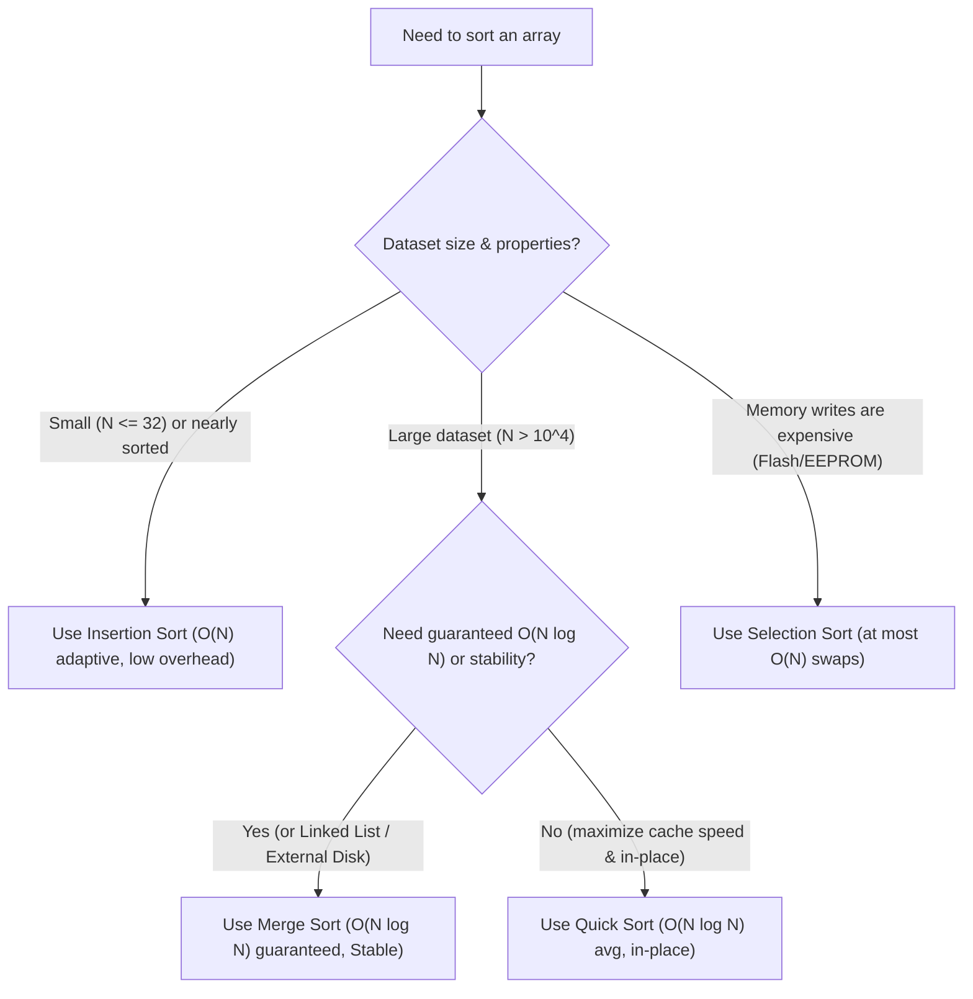

# Sorting Algorithms for DSA & Coding Interviews

This directory contains foundational comparison-based sorting algorithms and their formal pseudocode references commonly tested in technical interviews (such as Striver's A2Z DSA Sheet and LeetCode).

---

## 📊 Master Sorting Comparison Table

| Algorithm | Code | Pseudocode | Best Time | Avg Time | Worst Time | Space | Stable? | In-Place? |
| :--- | :--- | :--- | :---: | :---: | :---: | :---: | :---: | :---: |
| **Selection Sort** | [`selection_sort.py`](selection_sort.py) | [`selection_sort_pseudo_code.py`](selection_sort_pseudo_code.py) | $O(N^2)$ | $O(N^2)$ | $O(N^2)$ | $O(1)$ | No | Yes |
| **Bubble Sort** | [`bubble_sort.py`](bubble_sort.py) | [`bubble_sort_pseudo_code.py`](bubble_sort_pseudo_code.py) | $O(N)$ | $O(N^2)$ | $O(N^2)$ | $O(1)$ | Yes | Yes |
| **Insertion Sort** | [`insertion_sort.py`](insertion_sort.py) | [`insertion_sort_pseudo_code.py`](insertion_sort_pseudo_code.py) | $O(N)$ | $O(N^2)$ | $O(N^2)$ | $O(1)$ | Yes | Yes |
| **Merge Sort** | [`merge_sort.py`](merge_sort.py) | [`merge_sort_pseudo_code.py`](merge_sort_pseudo_code.py) | $O(N \log N)$ | $O(N \log N)$ | $O(N \log N)$ | $O(N)$ | Yes | No |
| **Quick Sort** | [`quick_sort.py`](quick_sort.py) | [`quick_sort_pseudo_code.py`](quick_sort_pseudo_code.py) | $O(N \log N)$ | $O(N \log N)$ | $O(N^2)$ | $O(\log N)$ | No | Yes |

---

## 🧠 Core Sorting Paradigms

### 1. Incremental & Iterative Sorting ($O(N^2)$)

1. **Selection Sort**:
   - **Strategy**: Scans the unsorted suffix to select the minimum element, then places it at the current boundary index.
   - **Key Advantage**: At most $O(N)$ swaps ($N - 1$ total memory writes in textbook form), useful when writing to memory is costly.
2. **Bubble Sort**:
   - **Strategy**: Repeatedly compares adjacent pairs, bubbling larger values to the right.
   - **Key Advantage**: With the `swapped` early-exit flag, detects already-sorted arrays in $O(N)$ time.
3. **Insertion Sort**:
   - **Strategy**: Extracts `key = A[i]` and shifts larger prefix elements rightward until the key's sorted position is reached (playing card analogy).
   - **Key Advantage**: Adaptive $O(N)$ best case, minimal constant factor overhead, and basis for standard library hybrid sorters (Python's Timsort).

---

### 2. Divide and Conquer ($O(N \log N)$)

1. **Merge Sort**:
   - **Strategy**: Bisects array at `middle = len(A) // 2`, recursively sorts both halves, and combines them in $O(N)$ time via two-pointer merge.
   - **Key Advantage**: Guaranteed $O(N \log N)$ performance on all inputs (immune to adversarial data), stable, and ideal for Linked Lists and External Sorting.
2. **Quick Sort**:
   - **Strategy**: Chooses a pivot (e.g. Lomuto's `A[-1]`), partitions smaller elements to the left and larger to the right, then recurses on the partitions.
   - **Key Advantage**: Outstanding cache locality and in-place sorting without auxiliary array allocation.

---

## 🎯 Decision Matrix: Which Algorithm to Use?

---

## 🔍 Detailed Algorithm Guides

- **Selection Sort**: Read [`selection_sort.py`](selection_sort.py) and [`selection_sort_pseudo_code.py`](selection_sort_pseudo_code.py).
- **Bubble Sort**: Read [`bubble_sort.py`](bubble_sort.py) and [`bubble_sort_pseudo_code.py`](bubble_sort_pseudo_code.py).
- **Insertion Sort**: Read [`insertion_sort.py`](insertion_sort.py) and [`insertion_sort_pseudo_code.py`](insertion_sort_pseudo_code.py).
- **Merge Sort**: Read [`merge_sort.py`](merge_sort.py) and [`merge_sort_pseudo_code.py`](merge_sort_pseudo_code.py).
- **Quick Sort**: Read [`quick_sort.py`](quick_sort.py) and [`quick_sort_pseudo_code.py`](quick_sort_pseudo_code.py).
