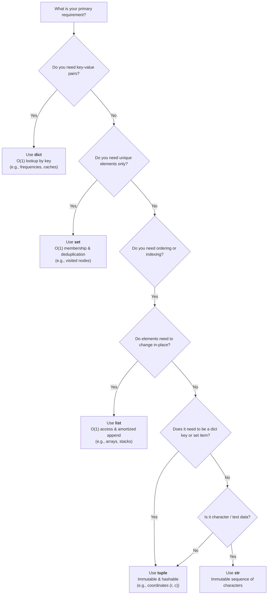

# Python Built-in Collections & Data Structures

This directory contains comprehensive, annotated reference scripts for the five fundamental built-in collection types in Python. Mastering their memory models, mutability rules, and Big-O operational costs is the foundation of efficient problem solving in Data Structures and Algorithms.

---

## 📂 File Index

| File | Type | Key Topic Covered |
| :--- | :--- | :--- |
| [`list.py`](list.py) | `list` (Dynamic Array) | Appending, inserting, in-place Timsort, slicing, comprehensions, 2D matrices |
| [`dict.py`](dict.py) | `dict` (Hash Map) | Hash table lookups, `.get()`, `.setdefault()`, `.popitem()`, view objects |
| [`set.py`](set.py) | `set` (Hash Set) | Deduplication, $O(1)$ membership, Venn diagram operations (union, intersection, etc.) |
| [`string.py`](string.py) | `str` (Immutable Text) | Character indexing, slicing, $O(n)$ `join` vs $O(n^2)$ loop concatenation, ASCII `ord`/`chr` |
| [`tuple.py`](tuple.py) | `tuple` (Immutable Sequence) | Hashable composite keys for DP/graphs, packing, unpacking, memory efficiency |

---

## 📊 Comparison Matrix

| Collection | Syntax | Mutable? | Ordered? | Duplicates? | Hashable? | Backing Implementation |
| :--- | :--- | :---: | :---: | :---: | :---: | :--- |
| **`list`** | `[1, 2, 3]` | **Yes** | **Yes** | **Yes** | **No** | Contiguous dynamic array of pointers |
| **`dict`** | `{"a": 1}` | **Yes** | **Yes** (Python 3.7+) | Keys: **No**, Values: **Yes** | Keys must be hashable; Dict itself: **No** | Combined table (hash indices + dense entry array) |
| **`set`** | `{1, 2, 3}` | **Yes** | **No** | **No** | **No** | Hash table with keys and dummy values |
| **`str`** | `"abc"` | **No** | **Yes** | **Yes** | **Yes** | Contiguous array of characters (ASCII/UCS-4) |
| **`tuple`** | `(1, 2, 3)` | **No** | **Yes** | **Yes** | **Yes** (if all elements are hashable) | Fixed-size contiguous array of pointers |

> [!IMPORTANT]
> **Empty Set vs Empty Dictionary**:
> - `{}` creates an empty **`dict`**, not a `set`!
> - An empty set must always be created using **`set()`**.

---

## ⏱️ Big-O Time Complexity Comparison

| Operation | `list` | `dict` | `set` | `str` | `tuple` |
| :--- | :--- | :--- | :--- | :--- | :--- |
| **Index Access** (`c[i]`) | $O(1)$ | N/A | N/A | $O(1)$ | $O(1)$ |
| **Key Lookup** (`d[k]`) | N/A | Average $O(1)$, Worst $O(n)$ | N/A | N/A | N/A |
| **Membership** (`x in c`) | $O(n)$ | Average $O(1)$, Worst $O(n)$ | Average $O(1)$, Worst $O(n)$ | $O(n + m)$ (substring) | $O(n)$ |
| **Insert / Append** | Append: $O(1)$ amortized<br>Insert: $O(n)$ | Average $O(1)$, Worst $O(n)$ | Average $O(1)$, Worst $O(n)$ | N/A (Immutable) | N/A (Immutable) |
| **Delete / Remove** | Pop end: $O(1)$<br>Remove: $O(n)$ | Average $O(1)$, Worst $O(n)$ | Average $O(1)$, Worst $O(n)$ | N/A (Immutable) | N/A (Immutable) |
| **Slicing** (`c[a:b]`) | $O(k)$ | N/A | N/A | $O(k)$ | $O(k)$ |
| **Concatenation** (`+`) | $O(n + m)$ | N/A (use `.update()` or `\|`) | N/A (use `\|`) | $O(n + m)$ | $O(n + m)$ |

*$k = \text{length of slice}$, $n = \text{size of collection}$, $m = \text{size of second operand}$.*

---

## 🎯 Which Collection Should I Choose in DSA?



---

## 💡 DSA Best Practices & Gotchas

1. **Avoid Quadratic String Concatenation**:
   ```python
   # ❌ Anti-pattern: O(n^2) time due to repeated memory allocations
   res = ""
   for ch in chars:
       res += ch

   # ✅ Optimal DSA pattern: O(n) linear time
   res = "".join(chars)
   ```

2. **2D Grid Memoization & Visited Coordinates**:
   - `list` is mutable and cannot be stored in a `set` or used as a `dict` key.
   - Always use **`tuple`** coordinates:
     ```python
     visited: set[tuple[int, int]] = set()
     visited.add((row, col))

     memo: dict[tuple[int, int], int] = {}
     memo[(row, col)] = result
     ```

3. **`defaultdict` and `.setdefault()` for Grouping**:
   When building adjacency lists or frequency buckets:
   ```python
   graph: dict[int, list[int]] = {}
   graph.setdefault(u, []).append(v)
   ```

4. **Safe Item Deletion in Sets**:
   - Use `s.remove(x)` when you want an explicit `KeyError` if `x` is absent.
   - Use `s.discard(x)` when the element might already be gone and you want silent safety.
