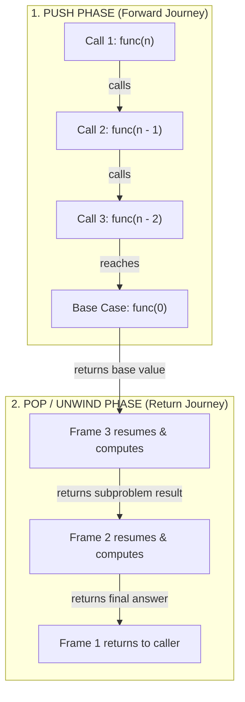

# Recursion Foundations for DSA & Coding Interviews

This directory contains foundational recursion patterns and algorithms commonly tested in technical interviews (such as Striver's A2Z DSA Sheet and LeetCode). Recursion is the cornerstone of advanced computer science paradigms including Divide & Conquer, Backtracking, Tree & Graph Traversals, and Dynamic Programming.

---

## 🧠 The 3 Pillars of Every Recursive Function

A recursive function is simply a function that calls itself to solve a smaller instance of the same problem. Every robust recursive function must have three essential components:

```text
+--------------------------------------------------------------+
| 1. BASE CASE (Termination)                                   |
|    - Condition that stops recursion.                         |
|    - Prevents infinite loops and RecursionError.             |
|    - Returns a known, trivial value (e.g., 0, 1, True, []).  |
+--------------------------------------------------------------+
                               |
                               v
+--------------------------------------------------------------+
| 2. CURRENT WORK / PROCESSING                                 |
|    - Performs the immediate operation for the current state. |
|    - Examples: print(i), swap(left, right), check equality.  |
+--------------------------------------------------------------+
                               |
                               v
+--------------------------------------------------------------+
| 3. RECURSIVE STEP (Subproblem Convergence)                   |
|    - Calls the function with smaller or simpler inputs.      |
|    - Must strictly make progress toward the Base Case.       |
+--------------------------------------------------------------+
```

---

## 🔄 Call Stack Mechanics: Push vs. Pop Phases

When a function calls itself, Python places a new **stack frame** onto the Call Stack:



- **Head Recursion**: Work is performed during the **unwind / pop phase** after the child call returns (e.g., `sum_of_n.py`, `factorial.py`).
- **Tail Recursion**: Work is performed during the **push phase** before or at the moment the child call is invoked (e.g., `print_n_to_1.py`, `reverse_array.py`).

---

## 📂 Master Catalog of Recursion Problems

| # | Problem | Script | Core Recursive Strategy | Time Complexity | Space (Stack) |
| :-: | :--- | :--- | :--- | :---: | :---: |
| 1 | **Print N Times** | [`print_n_times.py`](print_n_times.py) | Head recursion countdown | $O(N)$ | $O(N)$ |
| 2 | **Print Name N Times** | [`print_name_n_times.py`](print_name_n_times.py) | Parameterized counter `count + 1` | $O(N)$ | $O(N)$ |
| 3 | **Print 1 to N** | [`print_1_to_n.py`](print_1_to_n.py) | Ascending parameterized counter | $O(N)$ | $O(N)$ |
| 4 | **Print N to 1** | [`print_n_to_1.py`](print_n_to_1.py) | Descending countdown `n - 1` | $O(N)$ | $O(N)$ |
| 5 | **Sum of First N Numbers** | [`sum_of_n.py`](sum_of_n.py) | Functional return `N + sum(N - 1)` | $O(N)$ | $O(N)$ |
| 6 | **Factorial of N** | [`factorial.py`](factorial.py) | Functional return `N * fact(N - 1)` | $O(N)$ | $O(N)$ |
| 7 | **Sum of Array Elements** | [`sum_of_array_elements.py`](sum_of_array_elements.py) | Head element + sum of sliced tail | $O(N^2)$ (slice) / $O(N)$ (ptr) | $O(N)$ |
| 8 | **Reverse a String** | [`reverse_string.py`](reverse_string.py) | Tail extraction `s[-1] + rev(s[:-1])` | $O(N^2)$ | $O(N^2)$ |
| 9 | **Reverse an Array (In-Place)** | [`reverse_array.py`](reverse_array.py) | Two-pointer converging swaps | $O(N)$ | $O(N)$ |
| 10 | **Check Palindrome (Reverse)** | [`check_palindrome.py`](check_palindrome.py) | Reversal comparison `s == rev(s)` | $O(N^2)$ | $O(N^2)$ |
| 11 | **Check Palindrome (Boundary)** | [`check_palindrome_two_pointer.py`](check_palindrome_two_pointer.py) | Boundary matching `s[0] == s[-1]` | $O(N^2)$ (slice) / $O(N)$ (ptr) | $O(N)$ |
| 12 | **Check Prime** | [`prime_check.py`](prime_check.py) | Trial division countdown `divisor - 1` | $O(N)$ | $O(N)$ |
| 13 | **Check if Array is Sorted** | [`is_sorted.py`](is_sorted.py) | Adjacent comparison & tail slicing | $O(N^2)$ (slice) / $O(N)$ (ptr) | $O(N)$ |
| 14 | **Sum of Digits** | [`sum_of_digit_of_number.py`](sum_of_digit_of_number.py) | Modulo extraction `n % 10 + f(n // 10)` | $O(\log_{10} N)$ | $O(\log_{10} N)$ |

---

## 🔍 Detailed Problem Breakdowns

### 1. Basic Counting & Printing

#### 1.1 Print N Times
- **File**: [`print_n_times.py`](print_n_times.py)
- **Concept**: Head recursion where the recursive call `print_n_times(n - 1)` is made before `print(n)`.
- **Key Takeaway**: Because `print(n)` executes after the child call unwinds, the numbers print in ascending order ($1 \dots N$) despite recursing downwards.

#### 1.2 Print Name N Times
- **File**: [`print_name_n_times.py`](print_name_n_times.py)
- **Concept**: Parameterized recursion where `count` tracks iterations from $0$ up to $N$.
- **Base Case**: `if count == n: return`

#### 1.3 Print 1 to N
- **File**: [`print_1_to_n.py`](print_1_to_n.py)
- **Concept**: Tail-recursive ascending print. Prints `count` during the forward push phase, then increments `count + 1`.

#### 1.4 Print N to 1
- **File**: [`print_n_to_1.py`](print_n_to_1.py)
- **Concept**: Descending tail recursion. Prints `n` immediately and recurses with `n - 1` until $n < 1$.

---

### 2. Functional Recursion & Mathematical Accumulation

#### 2.1 Sum of First N Natural Numbers
- **File**: [`sum_of_n.py`](sum_of_n.py)
- **Recurrence Relation**:
  $$S(N) = N + S(N - 1), \quad S(0) = 0$$
- **Comparison**:
  - Recursive: $O(N)$ time, $O(N)$ stack space.
  - Mathematical Formula: $\frac{N(N + 1)}{2}$ in $O(1)$ time and $O(1)$ space.

#### 2.2 Factorial of N
- **File**: [`factorial.py`](factorial.py)
- **Recurrence Relation**:
  $$N! = N \times (N - 1)!, \quad 0! = 1$$
- **Edge Case**: $N = 0 \implies 1$ (multiplicative identity).

#### 2.3 Sum of Digits of a Number
- **File**: [`sum_of_digit_of_number.py`](sum_of_digit_of_number.py)
- **Mathematical Decomposition**:
  - Last digit: `n % 10`
  - Remaining digits: `n // 10`
- **Recurrence**:
  $$\text{sum\_digits}(N) = (N \pmod{10}) + \text{sum\_digits}(\lfloor N / 10 \rfloor)$$
- **Complexity**: $O(\log_{10} N)$ time and $O(\log_{10} N)$ auxiliary stack frames.

#### 2.4 Prime Check (Recursive Trial Division)
- **File**: [`prime_check.py`](prime_check.py)
- **Concept**: Tests candidate divisors counting down from $N - 1$ to $1$.
- **Base Cases**:
  - `number <= 1` $\implies$ `False`
  - `number == 2` $\implies$ `True`
  - `divisor == 1` $\implies$ `True` (no divisors found)
  - `number % divisor == 0` $\implies$ `False` (early exit on composite)
- **Optimization Note**: In production, trial division up to $\lfloor\sqrt{N}\rfloor$ reduces time to $O(\sqrt{N})$.

---

### 3. Array & Sequence Processing

#### 3.1 Sum of Array Elements
- **File**: [`sum_of_array_elements.py`](sum_of_array_elements.py)
- **Concept**: `numbers[0] + sum_of_array_elements(numbers[1:])`
- **Slicing vs Pointer**:
  - Slicing `numbers[1:]` allocates a new list on every call ($O(N^2)$ time).
  - Passing an `index: int = 0` eliminates list copying, achieving optimal $O(N)$ time.

#### 3.2 In-Place Array Reversal (Two-Pointer Technique)
- **File**: [`reverse_array.py`](reverse_array.py)
- **Concept**: Converging boundary pointers (`left` and `right`).
- **Base Case**: `if left >= right: return numbers`
- **In-Place Swap**: `numbers[left], numbers[right] = numbers[right], numbers[left]`
- **Recursive Step**: `left + 1`, `right - 1`
- **Complexity**: $O(N)$ time and $O(N)$ stack space ($O(1)$ auxiliary heap memory).

#### 3.3 Check if Array is Sorted
- **File**: [`is_sorted.py`](is_sorted.py)
- **Concept**: Non-decreasing check (`numbers[i] <= numbers[i + 1]`).
- **Base Case**: `if len(numbers) <= 1: return True`
- **Early Exit**: `if numbers[0] > numbers[1]: return False`
- **Recursive Step**: `check_sorted(numbers[1:])`

---

### 4. String Reversal & Palindromes

#### 4.1 Reverse a String
- **File**: [`reverse_string.py`](reverse_string.py)
- **Concept**: Extract rightmost character and append reversed prefix:
  $$\text{rev}(S) = S[-1] + \text{rev}(S[:-1])$$
- **Base Case**: `if len(string) <= 1: return string`

#### 4.2 Check Palindrome (Reverse & Compare)
- **File**: [`check_palindrome.py`](check_palindrome.py)
- **Concept**: Computes the reverse of the string recursively, then verifies `string == reversed_string`.

#### 4.3 Check Palindrome (Recursive Boundary Matching)
- **File**: [`check_palindrome_two_pointer.py`](check_palindrome_two_pointer.py)
- **Concept**: Compares outermost characters `string[0] == string[-1]` and recurses on inner substring `string[1:-1]`.
- **Early Exit**: If `string[0] != string[-1]`, halts immediately with `False`.

---

## ⚠️ Common Recursion Pitfalls & Best Practices

1. **Stack Overflow / `RecursionError`**:
   - Python's default recursion depth limit is 1,000 frames (`sys.getrecursionlimit()`).
   - For $N > 1,000$, convert the algorithm to an iterative approach or use explicit stack data structures.

2. **Hidden $O(N^2)$ Overhead from Slicing**:
   - `list[1:]` and `str[1:]` create a new shallow copy taking $O(k)$ time and space.
   - **Remedy**: Always pass integer index pointers (`index`, `left`, `right`) instead of slicing when optimal performance is required.

3. **Missing Base Case**:
   - Ensure every recursive branch guarantees progress toward a terminating base case.
   - Verify boundary edge cases: empty inputs (`[]`, `""`), single elements (`[x]`), and zero (`0`).
